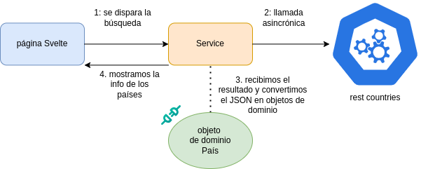

# Búsqueda de países

[](https://github.com/uqbar-project/eg-paises-svelte/actions/workflows/build.yml)


En este ejemplo podemos estudiar

- cómo funciona el routing de Svelte
- cómo es la búsqueda asincrónica en un origen externo
- un ejemplo de test end-to-end (e2e)

## Página principal



En la página inicial tenemos en la variante inicial 

- un input ligado a un estado: el país que vamos a buscar, con un plus: en el caso de que presionemos Enter también disparamos la búsqueda
- un botón que dispara la búsqueda, estará habilitado si escribimos algún valor en el input

```svelte
<script lang='ts'>
  let paisBusqueda = $state('')
  let buscarHabilitado = $derived(paisBusqueda.trim() !== '')
  const handleKeydown = ...
</script>
...

<input
  data-testid='paisBusqueda'
  onkeydown={handleKeydown}
  bind:value={paisBusqueda}
  placeholder='Ingrese un valor para buscar países'
/>
<button data-testid='buscar' onclick={buscar} disabled={!buscarHabilitado}>Buscar</button>
```

### La búsqueda

Como vamos a pedir información a una fuente externa, no podemos saber a priori cuánto va a tardar, entonces tenemos que hacer una llamada **asincrónica**. Definimos entonces un componente aparte, que llamamos **service** y que tendrá como responsabilidades

- saber dónde hay que obtener la información
- convertir la información recibida en objeto/s de dominio

En la página escribimos

```ts
const buscar = async () => {
  paises = await paisService.buscarPais(paisBusqueda)
}
```

y el service se define además como una clase pero exponemos una instancia, que termina siendo un **Singleton**:

```ts
class PaisService {
  async buscarPais(paisBusqueda: string): Promise<Pais[]> {
    const response = await axios.get(`${BASE_URL}/${VERSION}/name/${paisBusqueda}`)
    return response.data.map(toPais)
  }
  ...
}

export const paisService = new PaisService()
```

Estamos utilizando la biblioteca `axios` que sabe hacer pedidos por http y devolver el resultado con el formato de una response. Para el siguiente ejemplo veremos cómo hacer el manejo de errores.

La función `toPais` pueden verla, se encarga de construir un objeto de dominio en base a la información que nos llega. Eso es útil porque un País sabe

- si está superpoblado (en base a la densidad)
- qué hora es (en base a su timezone)

y podría tomar más responsabilidades. Además, en este caso no tenemos control sobre la API a la que le llamamos, por lo que es una opción más que rentable.

### Lista de países

Una vez que tenemos la lista de países, los mostramos en una grilla:

```svelte
{#each paises as pais, indice}
  <button
    class='pais'
    data-testid={`pais-${indice}`}
    onclick={() => goto(`/pais/${pais.codigo}`)}
  >
    <Bandera bandera={pais.bandera}/>
    <div class='nombre_pais'>{pais.nombre}</div>
  </button>
{/each}
```

El lector podrá pensar, ¿por qué un button y no un div? Esto tiene que ver con recomendaciones de usabilidad que Svelte aplica, por lo que si usamos un div te va a aparecer un molesto warning:


Para más información podés ver [este artículo](https://svelte.dev/docs/svelte/compiler-warnings).

## Routing en Svelte

La url a la que vamos se activa con el botón:

```ts
 ... onclick={() => goto(`/pais/${pais.codigo}`)}
 // `goto` es una función provista por una biblioteca que viene con Svelte
```

Para Argentina, esto equivale a `http://localhost:5173/pais/ARG`. ¿Quién responde a este pedido del cliente?

Como cuenta [esta página](https://svelte.dev/docs/kit/routing), el mecanismo de routing sigue una convención, donde toda ruta se ubica por defecto dentro de nuestro proyecto en la carpeta `src/routes`. Por eso la página principal es `+page.svelte` pero además tenemos esta estructura

```
- pais              # carpeta con un nombre fijo
  - [code]          # carpeta encerrada entre corchetes, marca una ruta parametrizable
    - +page.svelte  # la página Svelte que va a ser invocada cuando llamemos a esta ruta
```


### CSR y SSR

Ok, sabemos cómo llegamos a la página Svelte, pero todavía falta tomar una decisión: el pedido del cliente

- puede procesarse dentro del cliente mismo (**CSR** o client-side rendering): en este caso el navegador hace un cambio dinámico de la página, modificando los elementos del DOM. Podés ver [un ejemplo práctico](https://www.freecodecamp.org/news/dom-manipulation-in-javascript/) de cómo se logra esto con javascript puro.
- o ser enviada al servidor (**SSR** o server-side rendering): en este caso vamos a enviar al servidor, el que localmente responde en el puerto 5173 pero deployado podría estar en la nube más adelante. En ese caso lo que haría es resolver toda la lógica de la vista (incluido llamadas a la API) y devolver html con código de Svelte para ejecutar en el cliente.

¿Qué nos conviene más? Cada opción tiene ventajas y desventajas, por el momento vamos a optar por la opción 1 ó client-side rendering, entonces escribimos un archivo de nombre `page.ts`, donde vamos a procesar el parámetro con el código del país y haremos una llamada asincrónica a la API rest countries para obtener el objeto de dominio país: esto no es estrictamente necesario pero lo hacemos para mostrar didácticamente lo que en la mayoría de las aplicaciones sí tiene sentido.

```ts
import { paisService } from '$lib/paisService'

export async function load({ params }) {
  const pais = await paisService.datosDePais(params.code)
  return { pais }
}
```

La forma de obtener los parámetros es mediante la variable global `params`, donde debemos respetar el mismo nombre que el que definimos en la carpeta.

Luego la operación se completa recibiendo en la página una $props pais:

```svelte
let { data } = $props()
const { pais } = data
```

El lector puede profundizar viendo la implementación del ejemplo.

## Ejecutando tests e2e

Tenemos que instalar localmente Playwright para lo cual escribimos

```bash
yarn playwright install-deps
yarn playwright install
```

Ahora sí podemos ejecutar los tests end to end, que lo podemos hacer 

- desde un navegador
- o simulando la interacción con un navegador desatendido, lo que comunmente se denomina _headless_

Para eso escribimos `yarn run test:e2e`, y eso nos abrirá un menú interactivo donde nos carga cada uno de los tests y allí seleccionamos el test que queremos ejecutar:


Más allá de las [cuestiones técnicas de los tests end to end](https://docs.google.com/presentation/d/1dYxP9kOdA_iggZmm3Zqa3dbmJbqwANi8eCjFSJWqXi4/edit?usp=drive_link), podemos hacer un breve resumen de lo que aplicamos en este ejemplo:

- estamos probando un flujo feliz, lo más controlado posible, por eso hay un solo test
- mientras que los tests unitarios prueban una pequeña funcionalidad (por ejemplo podríamos tener 2 tests para probar las clases de equivalencia de si un país es superpoblado o no), el test end to end incluye la UI y la parte de servicios del front, la API Rest countries y la interacción de la aplicación en general
- los tests end to end tardan más, necesitan tiempo para que el frontend actúe con sus mecanismos asincrónicos
- no estamos probando los casos de error, podríamos pero no deberían ser exhaustivos porque cada test end-to-end tiene un alto costo
- incluir a la API Rest countries puede ser un tanto controversial, porque no es un componente que nosotros tengamos control. Sin embargo estamos probando que el contrato de la API sigue funcionando tal cual lo esperado, lo que se conoce como [**Contract Test**](https://docs.gitlab.com/ee/development/testing_guide/contract/)

### Configuración de Playwright

Playwright tiene una configuración donde define cuáles son los archivos de testeo end-to-end, así como la carpeta, porque recordemos que **los tests e2e no reemplazan sino que complementan los tests unitarios**:

```ts
import { defineConfig } from '@playwright/test'

export default defineConfig({
  webServer: {
    command: 'npm run build && npm run preview',
    port: 4173
  },

  testDir: 'e2e'
})
```

### Anatomía de un test

Ahora sí vamos a ver el test, no demasiado diferente a lo que veníamos haciendo:

```ts
test('flujo principal: buscamos un país y al hacer click nos dirige a la página con la información de dicho país', async ({
  page
}) => {
  await page.goto('/')
  await expect(page.locator('h2')).toBeVisible()
  await page.getByTestId('paisBusqueda').fill('ARGENTINA')
  await page.getByTestId('buscar').click()
  const unPais = await page.getByTestId('pais-0')
  await expect(unPais).toBeVisible()
  ...
})
```

Sí podrán notar que todas las operaciones son asincrónicas, y requieren envolverse dentro de un `await`. Eso permite que esperemos un tiempo prudencial (5 segundos) hasta que el elemento que buscamos aparezca en el DOM. Seguimos prefiriendo la búsqueda por `data-testid`, o por `role` más que por clases css o texto.

### Qué pasa cuando fallan los tests

Por suerte Playwright, al igual que otras tecnologías como Cypress, Selenium o TestCafé, ofrecen buenos mecanismos de análisis de errores:


## Debouncing

- Usar un mecanismo de debouncing para disparar las consultas de los países directamente, porque la API te permite 10 request por minuto